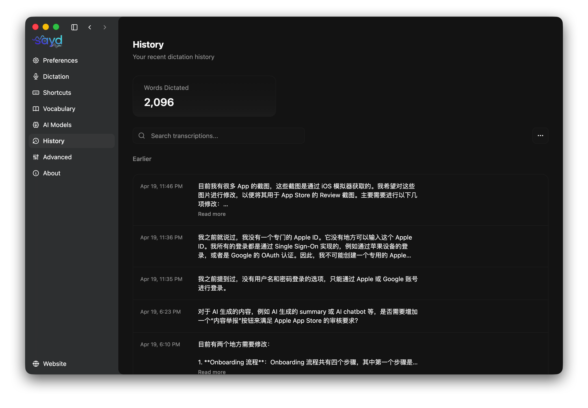

  

  
  

  <a href="https://sayd.dev">Website</a> · <a href="https://sayd.dev/docs">Docs</a> · <a href="https://github.com/teaguexiao/sayd-desktop/issues/new?assignees=&labels=bug&template=bug_report.md">Report a bug</a>

> Sayd is a fork of [amicalhq/amical](https://github.com/amicalhq/amical), rebranded and adapted to use [Sayd Cloud](https://sayd.dev) for transcription. Huge thanks to the Amical team for the original work.

## Table of Contents

- [Download](#download)
- [Overview](#overview)
- [Features](#features)
- [Tech Stack](#tech-stack)
- [Acknowledgements](#acknowledgements)
- [License](#license)

## Download

Grab the latest build for your platform:

| Platform | Download |
| --- | --- |
| macOS (Apple Silicon) |  |
| macOS (Intel) |  |
| Windows (x64) |  |

All releases: <https://github.com/teaguexiao/sayd-desktop/releases>

## Overview

Sayd is an AI-powered dictation app. Powered by [Sayd Cloud](https://sayd.dev) for real-time speech-to-text with built-in LLM text cleaning, Sayd delivers fast and accurate dictation.

Context-aware dictation that adapts to what you're doing: drafting an email, chatting on Discord, writing prompts in your IDE, or messaging friends. Sayd detects the active app and formats your speech accordingly.

## Features

- Super-fast dictation with AI-enhanced accuracy
- Context-aware speech-to-text based on the active app
- Real-time cloud transcription with built-in LLM text cleaning
- Multilingual support
- Floating widget for frictionless start/stop with custom hotkeys
- Extensible via hotkeys, voice macros, custom workflows

## Tech Stack

- [Sayd Cloud](https://sayd.dev) — real-time cloud transcription with built-in LLM cleaning
- [TypeScript](https://www.typescriptlang.org/)
- [Electron](https://electronjs.org/)
- [TailwindCSS](https://tailwindcss.com/)
- [Shadcn](https://ui.shadcn.com/)
- [Zod](https://zod.dev/)
- [Jest](https://jestjs.io/)
- [Turborepo](https://turbo.build/)

## Acknowledgements

Sayd is built on top of [amicalhq/amical](https://github.com/amicalhq/amical). The core dictation engine, window management, and Electron scaffolding are inherited from that project. Sayd adds the Sayd Cloud transcription provider, rebrands the UI, and tailors the app for the Sayd ecosystem.

## License

Released under [MIT][license], same as the upstream project.

<!-- REFERENCE LINKS -->

[license]: https://github.com/teaguexiao/sayd-desktop/blob/main/LICENSE
